# Team Bully Maguire

## Lone Music - Milestone 1

### Data Interactions

- Upload Instrumental
- Upload Vocals in response to Instrumental
- Like/Dislike Instrumental/Vocals
- Comment on Instrumental
- Account configuration

### Wireframes
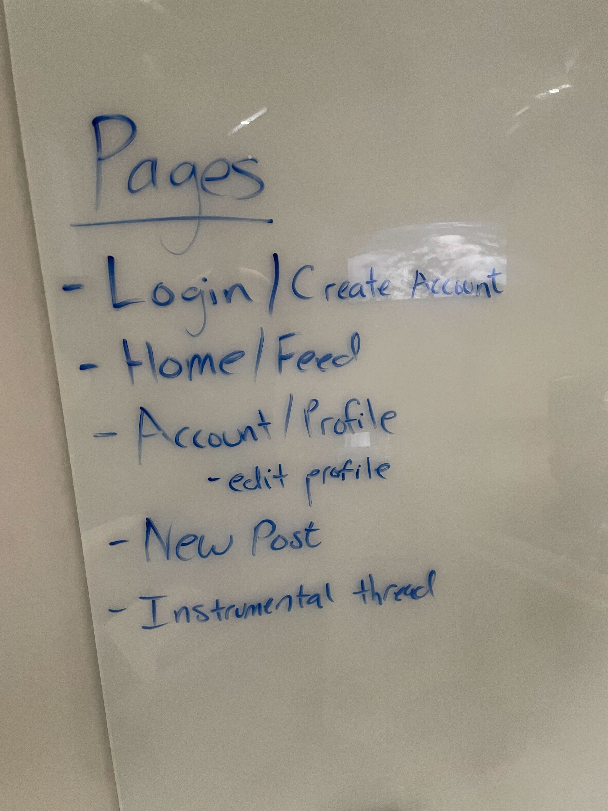
This depicts a rough layout of how our pages look and where information will be stored.

This is the first mockup of the main feed of the site. This layout includes the LONE Music logo along with a profile setting/logo in the header. This also details the filters used for populating posts. 
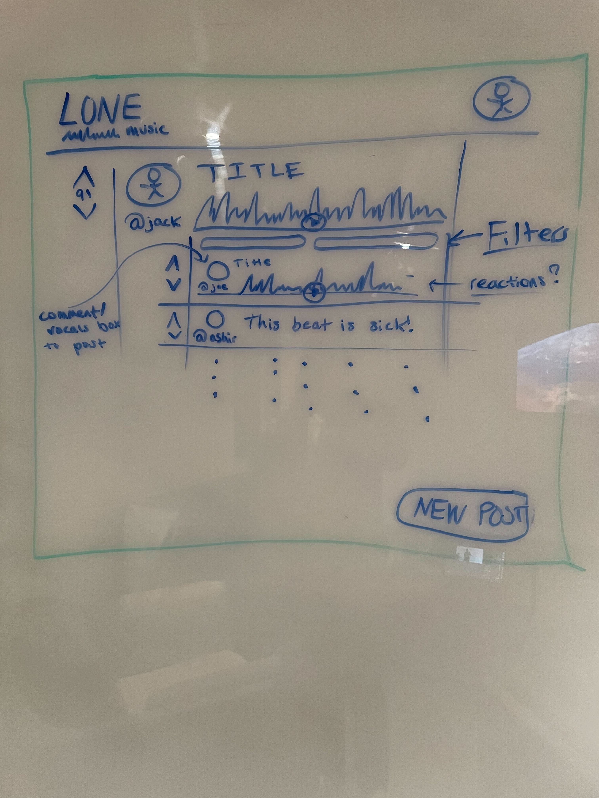
This is a rough layout of the beat reply system where you can choose to comment or add a vocal for others to see. This includes a filter (like/dislike) system for each comment. 
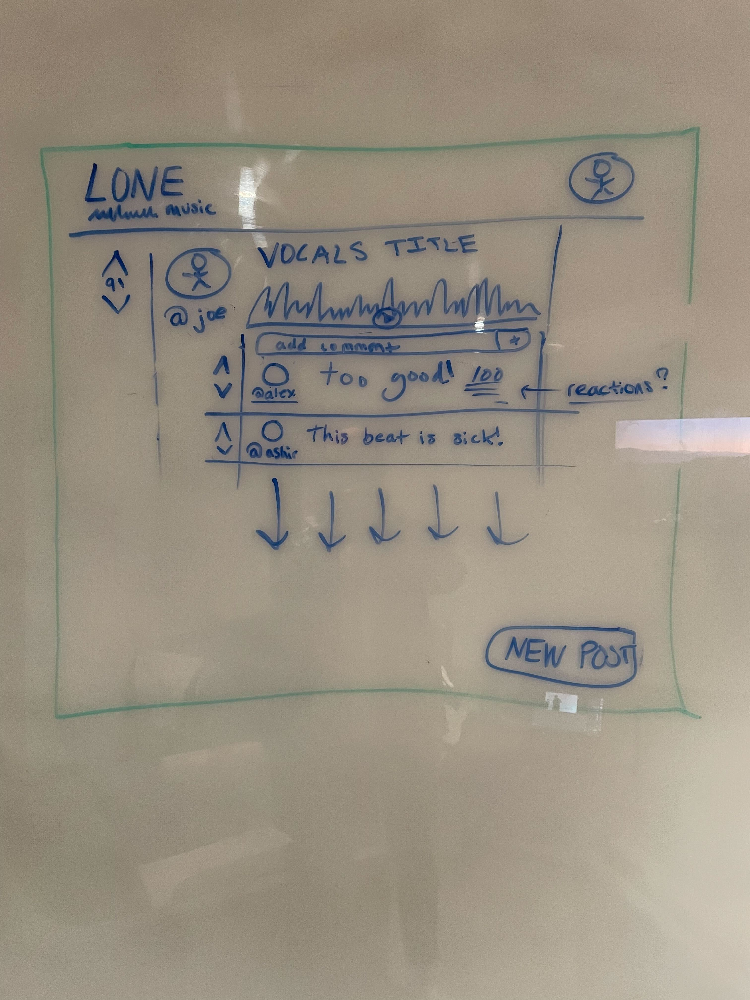
This is the first sketch of the vocal thread page, where you are able to comment on someone vocal cover of a beat.
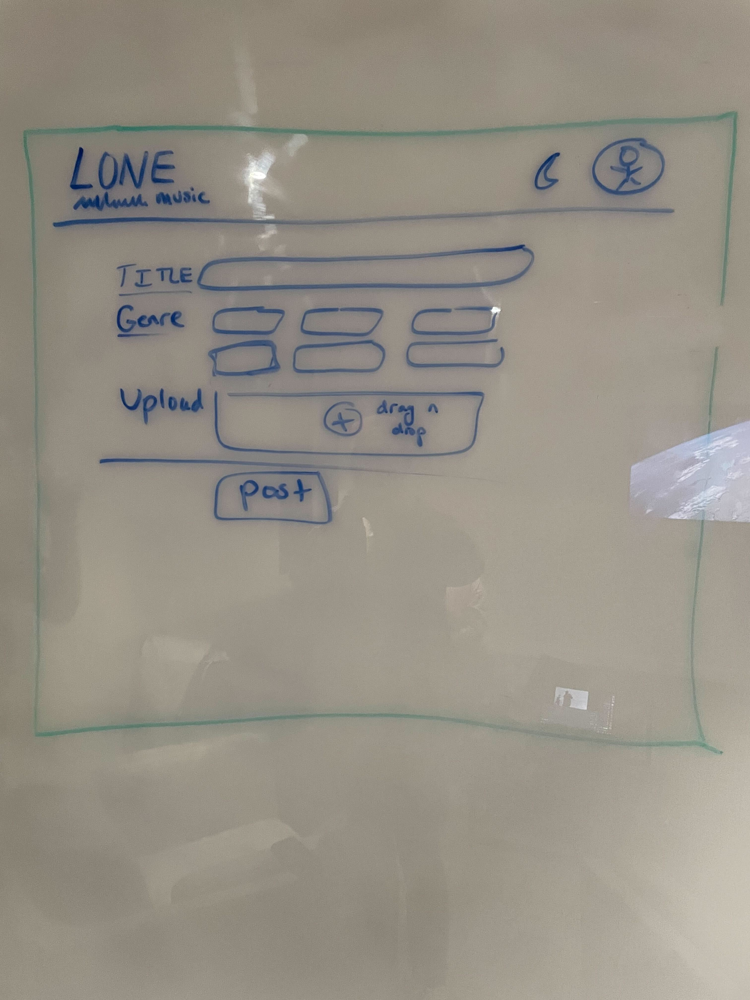
This is the sketch of the uplaod page where the user can upload a beat.

This is the first sketch of the login page.
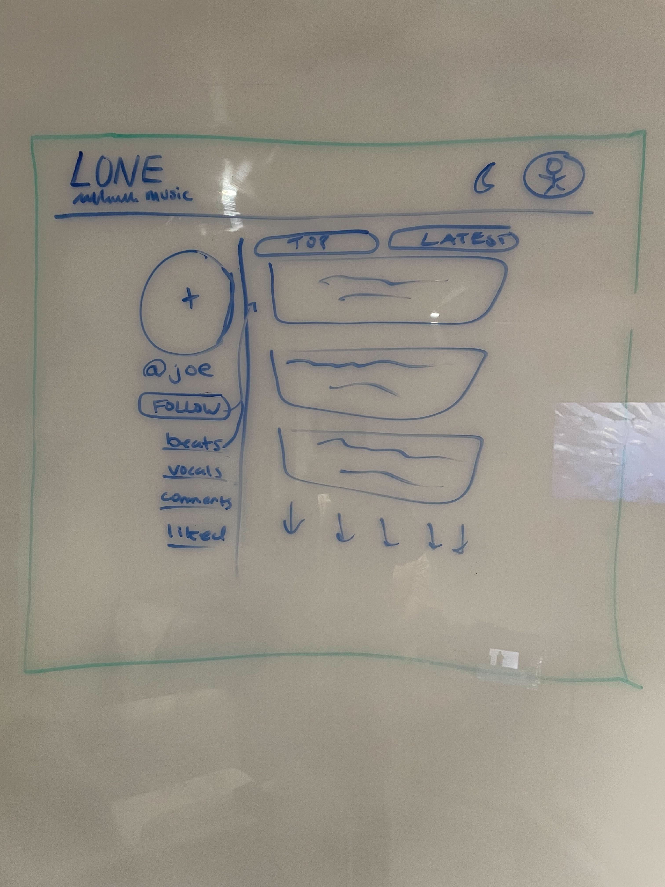
This is the first sketch of the profile page with information about the users beats,vocals,comments, and likes. Along with the ability to follow that user. 
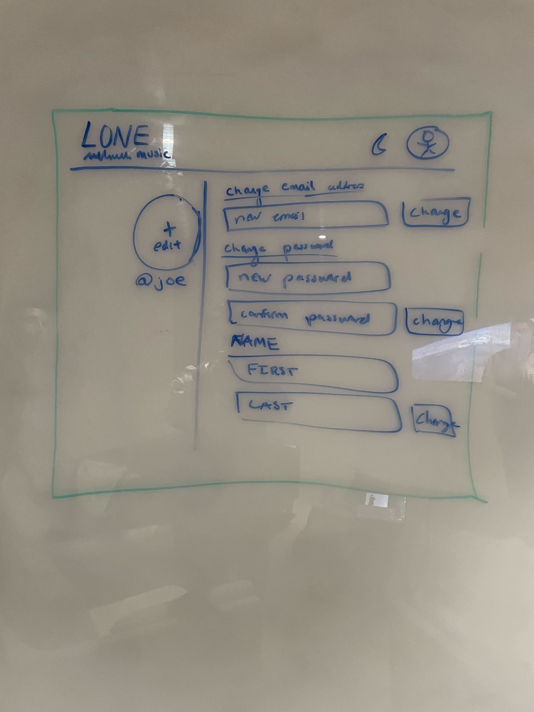
This is the first sketch of your profile settings/profile. 
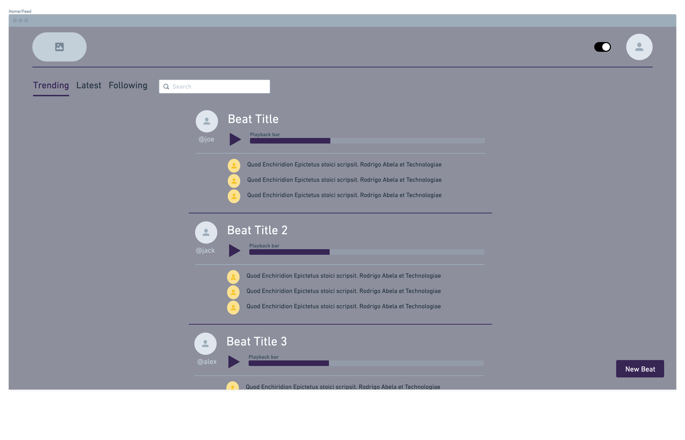
This is the first draft of the Index sketch with a more finalized look.
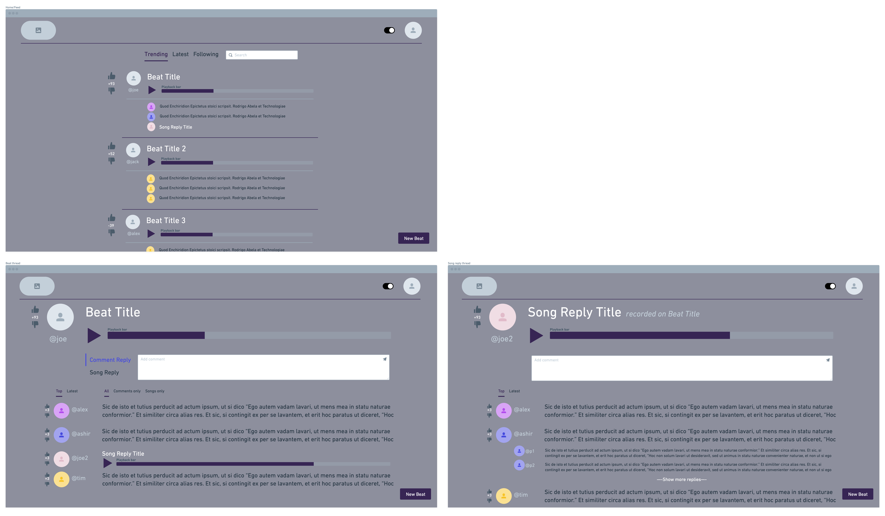
This is the first draft of the Beat/Song Reply page with Index main feed.

### HTML/CSS Mockups

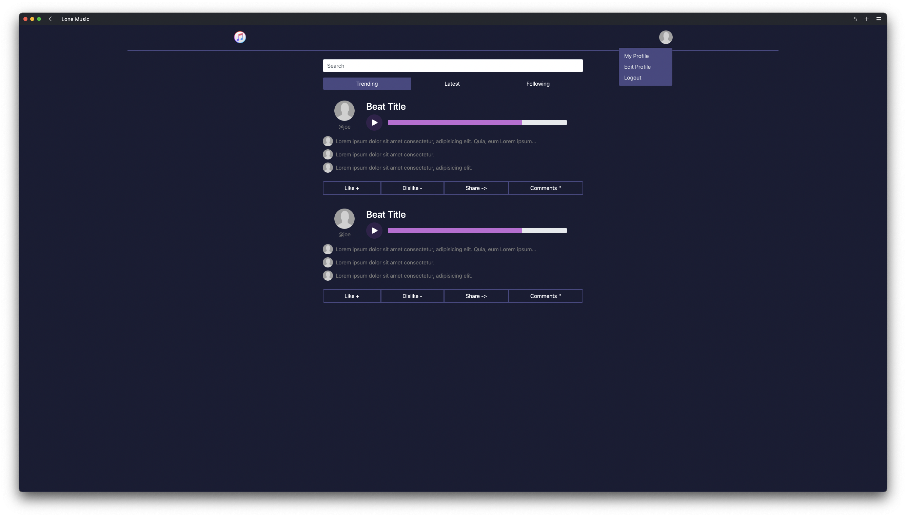
This is the home page, which is the main feed of the site. Here is a social media like feed interface where new posts are loaded. Users can play the beat, see the top few comments, and interact with it by liking, disliking, sharing, or going to the comments section. The user can also sort the feed, from trending posts, latest posts, to posts by people that the user is following.
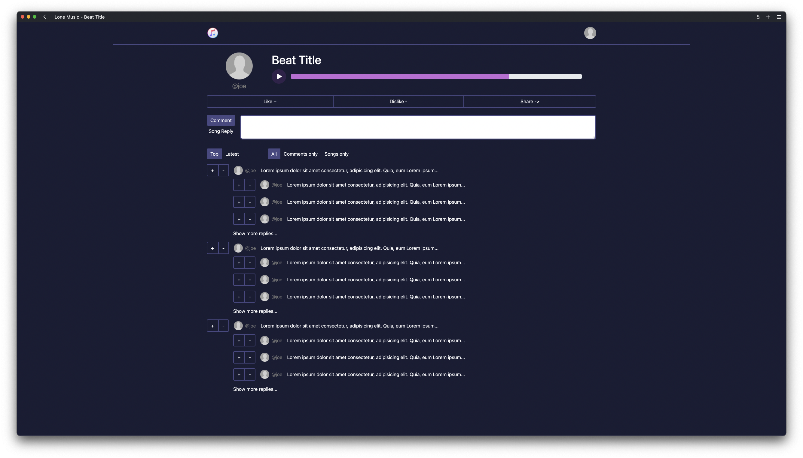
This is a thread for a beat post. The top contains the information about the beat, similar to the feed, and under it is a toggle for either replying with a comment or song. Under that is the replies portion of the thread, which has two sorting categories: sorting replies by top/latest, or sorting between comments and songs. Then finally, there are the replies themselves, which have a like and dislike button next to each of them. There are nested replies as well (only one level).
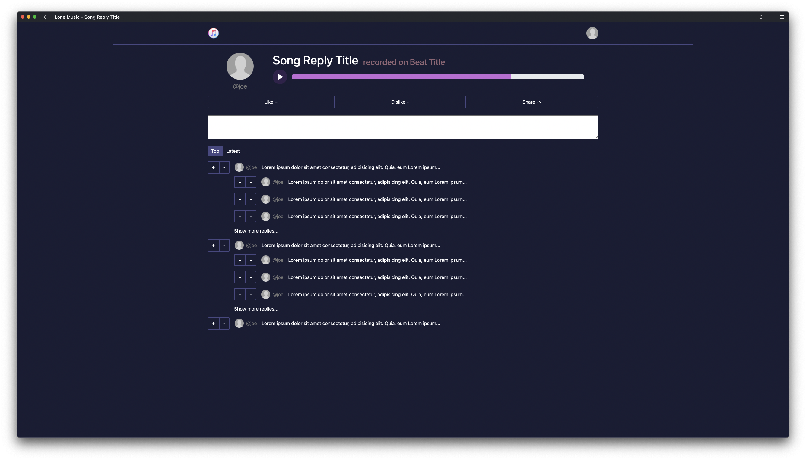
This is a thread for a song reply. It's very similar to a beat thread page, and says which beat the song was recorded on. Here there is only the ability to comment, with the comment thread underneath.
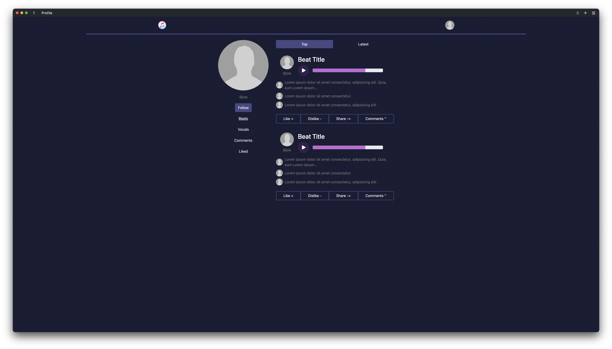
This is a user's profile page. It has their picture and name on the side, as well as a follow button, and filter buttons for what is on the main view: the users beats, vocals, comments, and things they have liked. These can all be sorted by top or latest.
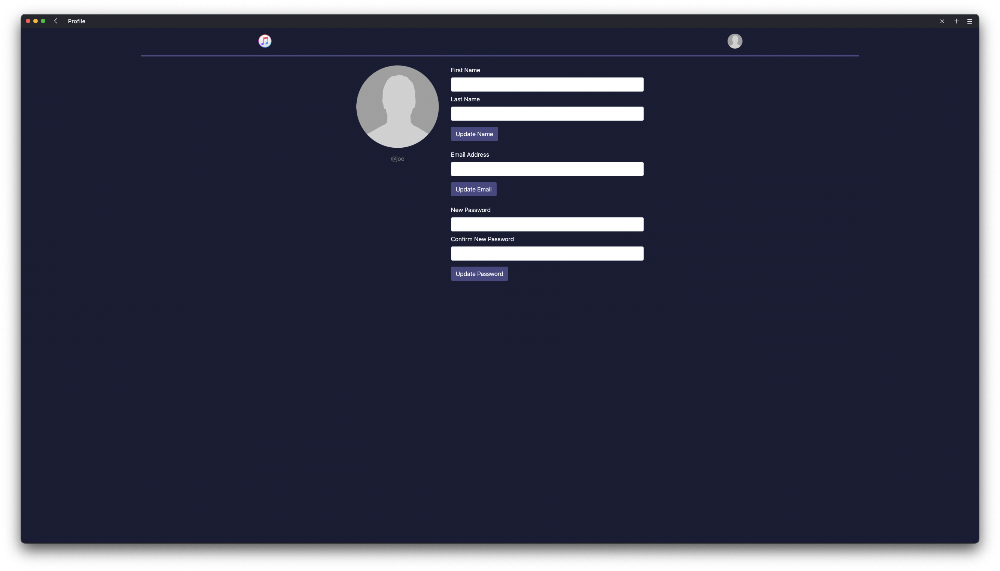
This is the edit account page, where a user can update their name, email address, password, and profile picture.
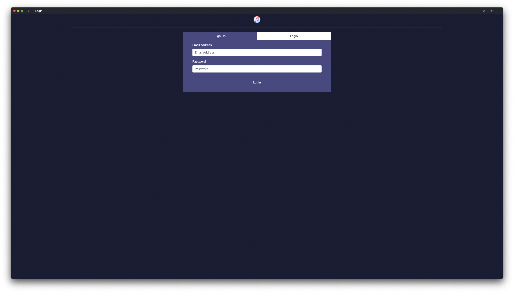
The login/signup page, currently on the log in view. Logging in will be done via email addresses.
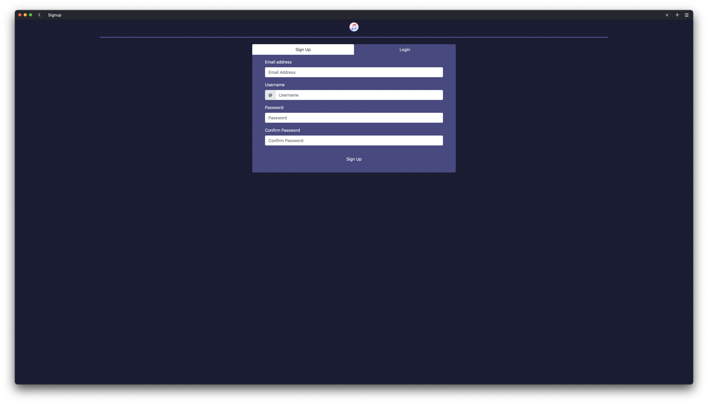
The login/signup page, currently on the sign up view.
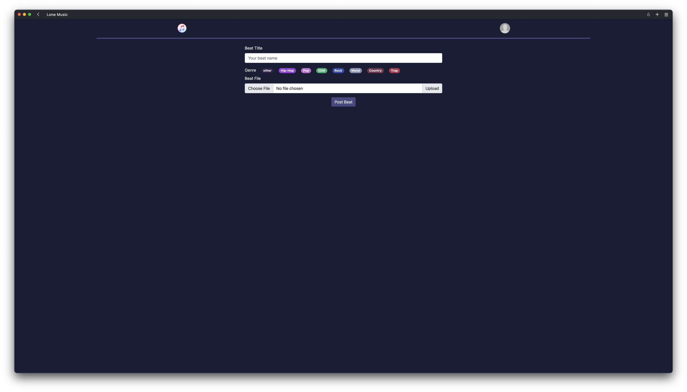
This is the upload beat page, where the user can type in the beat title, choose the genre through tags, and upload a file. In the future this might be a modal instead of a page.

### Workload split

Alex: Beat page, Song page, Upload Page, Upload Wireframes/Division of Labor
Ashir: Beat page, Song page, Upload Page, Digital Wireframes, HTML Screenshots/Descriptions
Jack: Login Page, Sign Up page, Profile Page, Account Page, Link Pages together, Revise CSS
Joe: Login Page, Sign Up page, Profile Page, Account Page, Validate HTML, Revise CSS, Data Interactions
All: Wireframe drawings, Index.html (main feed page)